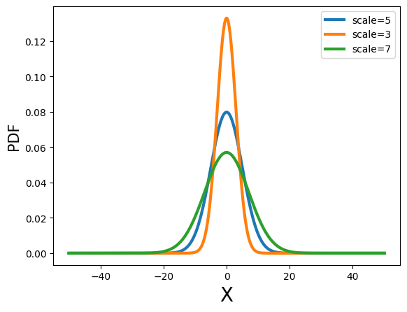
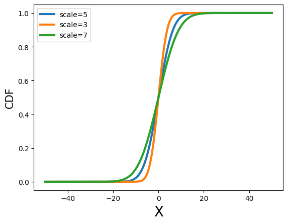

# Python in Water Resources

## Matplotlib
#### Plot
The plot() function is used to create line plots. It connects data points with lines in the order they appear in the input sequence. This is useful for visualizing trends and relationships between variables over a continuous range. 
#### Scatter pp.set_index('Datetime')
The scatter() function is used to create scatter plots. It plots individual data points without connecting them with lines. This is useful for visualizing the relationship between two variables, where each point represents an observation. Scatter plots are often used to identify patterns, correlations, or outliers in the data. Additionally, scatter() allows for varying the symbol, size, and color of the points, providing more flexibility in visual representation

## Pandas

### Important to process
In read_csv is important to select __skiprows=#__ for possible text before, __delimiter='\t'__ for delimiter in same line, can be __,__ or __.__ as well.
With __index_col='name'__ select the  __parse_dates=True__, parse_dates starts with the index.

### Key Panda Functions

```python
pp = pd.read_csv('../Data/pp.csv')
pd.to_datetime(pp['Datetime'])

st1 = pd.read_csv('../Data/st1.txt',skiprows=28,delimiter='\t',index_col='datetime',parse_dates=True)[1:]
st1.columns = ['agency','site','pp1','code']
st1.pp1 = pd.to_numeric(st1.pp1, errors='coerce')
```

### Key Dataframe Functions

```python
pp = pd.read_csv('../Data/pp.csv')
pp.set_index('Datetime')
pp['Ppt'].describe()
# for 10 years: 1950 to 1960
pp['Ppt'].loc['1950-01-01':'1959-12-31'].describe()
```


## Scipy

### Statistics
Usage package scipy.stats, allows to have the whole process in statistical analysis.
Linear regresion gives: Slope, Intercepts, Correlation Coefficient, Pvalue and Standard Error

The best way to see precipitation data is as with distributions, having as a main property **mean** and **standard deviation** and with that the probability density function and cumulative desnity function can be calculated.

### Interpolation
Using interpolate.interp1d returns a interpolation function for a serie of (x, y) values.
Standard is Lineall but can be changed to queadratic 
f = interp1d(x, y, 'quadratic')

### Correlations
Correlation is a measure in statistics dependecy, can be monotonic or not monotonic. The three principal correlations are:
- **Pearson's r** (Most used): Linear coefficient, measure the lienal association in two variables.
- Spearman's p
- Kendall tau t

### Missing Data


### Key Scipy Functions

```python
import scipy.stats as st
# To do a linear regression
Splope, intercept, rvalue, pvalue, erro = st.linregress(x, y)
#Mean, standard deviation
d = st.norm(loc=0, scale=5) # scale change height of the distribution
# pdf = probability density function
x = np.linspace(-50,50, 1000)
y1 = d.pdf(x)
```



```python
# Interpolate
from scipy.interpolate import interp1d
x = np.linspace(0,1,5)
y = np.exp(-x)
f = interp1d(x, y)
xnew = np.linspace(x.min(), x.max())
ynew = f(xnew) # use interpolation function returned by `interp1d`
# plot
plt.plot(x, y, 'ro', label='y')
plt.plot(xnew, ynew, '-', label='ynew')
```

```python
x = np.linspace(0,10)
y1 = 2*x
r1, p1 = st.pearsonr(x,y1)
s1, ps1 = st.spearmanr(x,y1)
tau1, pt1 = st.kendalltau(x,y1)
```

```python
ll = [st.scoreatpercentile(X_err[:,i], 10) for i in range(X_err.shape[1])] # 10th percentile
ml = [st.scoreatpercentile(X_err[:,i], 50) for i in range(X_err.shape[1])] # 50th percentile
ul = [st.scoreatpercentile(X_err[:,i], 90) for i in range(X_err.shape[1])] # 90th percentile

plt.plot(ml, 'g', lw=2, label='Median')
plt.plot(ul, '--m', label='90%')
plt.plot(ll, '--b', label='10%')
```

```python

```


## Examples

### 1. 

```python
ws = pd.read_excel('../Data/station2.xlsx',skiprows=2,index_col='FECHA',parse_dates=True)
ws.head()
ws.plot()
promedio = ws['VALOR'].mean()
desviacion = ws['VALOR'].std()
# Determinaos regresiones probabilisticas
tabulaciones = np.arange(ws['VALOR'].min(),ws['VALOR'].max(),0.1)

distnormal = st.norm.pdf(tabulaciones, 
                            loc=promedio, scale=desviacion)
distlognormal = st.pearson3.pdf(tabulaciones,skew=1,
                                   loc=promedio, scale=desviacion)
distweibull = st.dweibull.pdf(tabulaciones,c=1,
                                   loc=promedio, scale=desviacion)
distchi2 = st.chi2.pdf(tabulaciones,df=2,
                                   loc=promedio, scale=desviacion)

# Histogramas y distribución de probabilidades
ws['VALOR'].hist(bins=20, edgecolor='#4aaaaa', color='#80BCD8',density=True)
plt.plot(tabulaciones,distnormal, color='#4B4C4E', linewidth=5, linestyle='--',label='Dist Normal')
plt.plot(tabulaciones,distlognormal, color='#3F83B7', linewidth=5, linestyle='--', label='Dist Lognormal')
plt.plot(tabulaciones,distweibull, color='#7B7C7E', linewidth=5, linestyle='-.', label='Dist Weibull')
plt.plot(tabulaciones,distchi2, color='#3F83B7', linewidth=5, linestyle=':', label='Dis Chi2')
plt.legend(loc='upper right')
plt.rcParams['figure.figsize'] = 15, 4
```

### 2 

```python
# generate some data
x = 100*np.sin(np.linspace(0,10,100))
X = np.vstack([x]*20)
e = 10*np.random.randn(20,100)

X_err = X+e

plt.plot(X_err.T, 'k')
plt.xlabel('Time')
plt.ylabel('X')

ll = [st.scoreatpercentile(X_err[:,i], 10) for i in range(X_err.shape[1])] # 10th percentile
ml = [st.scoreatpercentile(X_err[:,i], 50) for i in range(X_err.shape[1])] # 50th percentile
ul = [st.scoreatpercentile(X_err[:,i], 90) for i in range(X_err.shape[1])] # 90th percentile

plt.plot(ml, 'g', lw=2, label='Median')
plt.plot(ul, '--m', label='90%')
plt.plot(ll, '--b', label='10%')
plt.xlabel('Time')
plt.ylabel('X')
plt.legend(loc='best')

plt.plot(ml, 'g', lw=2, label='Median')
plt.fill_between(range(100), ul, ll, color='k', alpha=0.4, label='90%')
plt.xlabel('Time')
plt.ylabel('X')
plt.legend(loc='best')
```